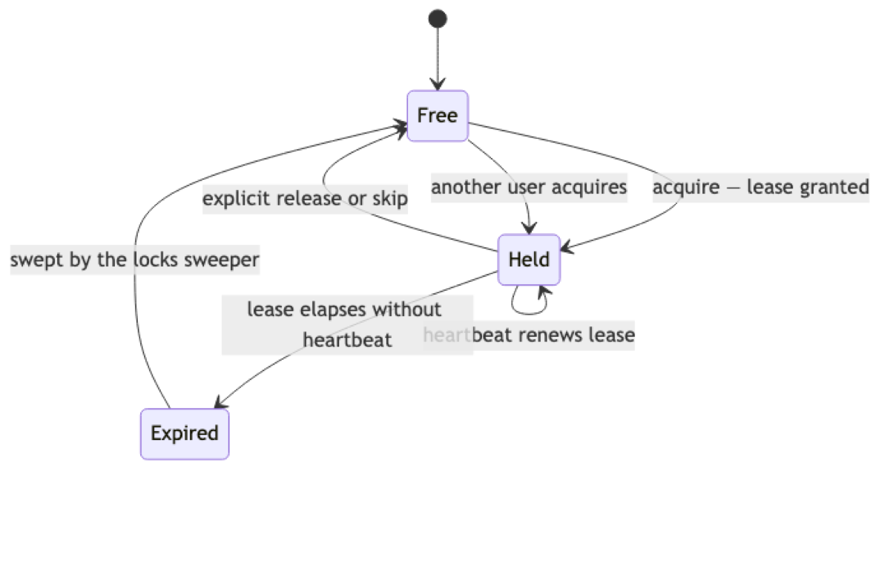
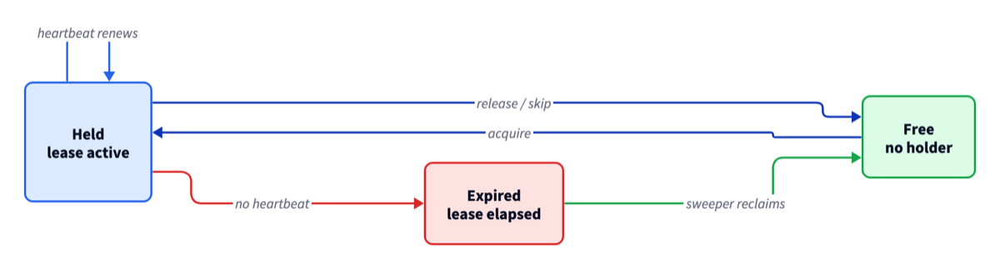
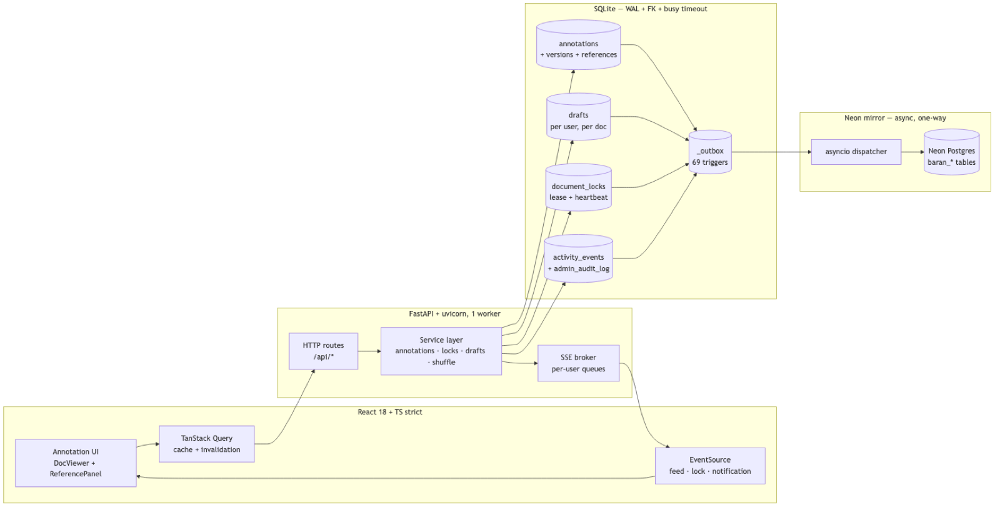
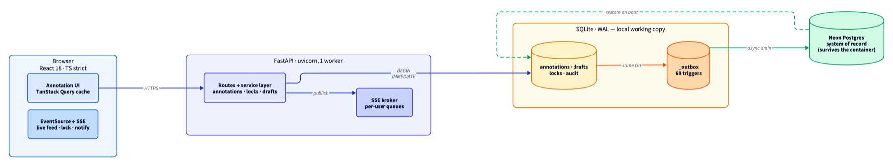
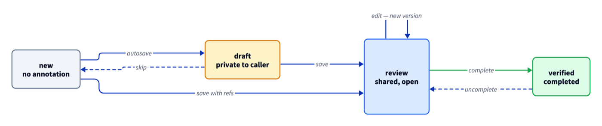
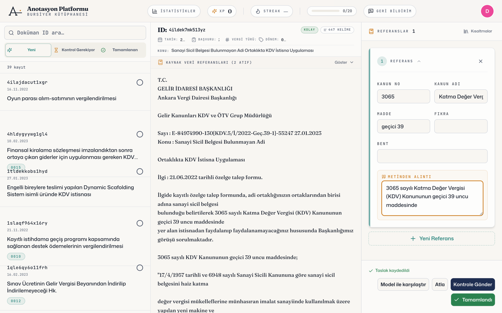
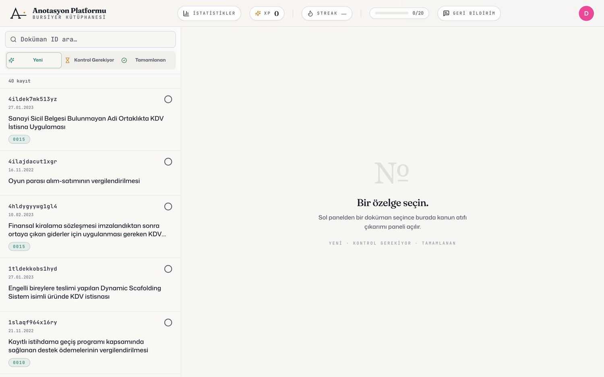
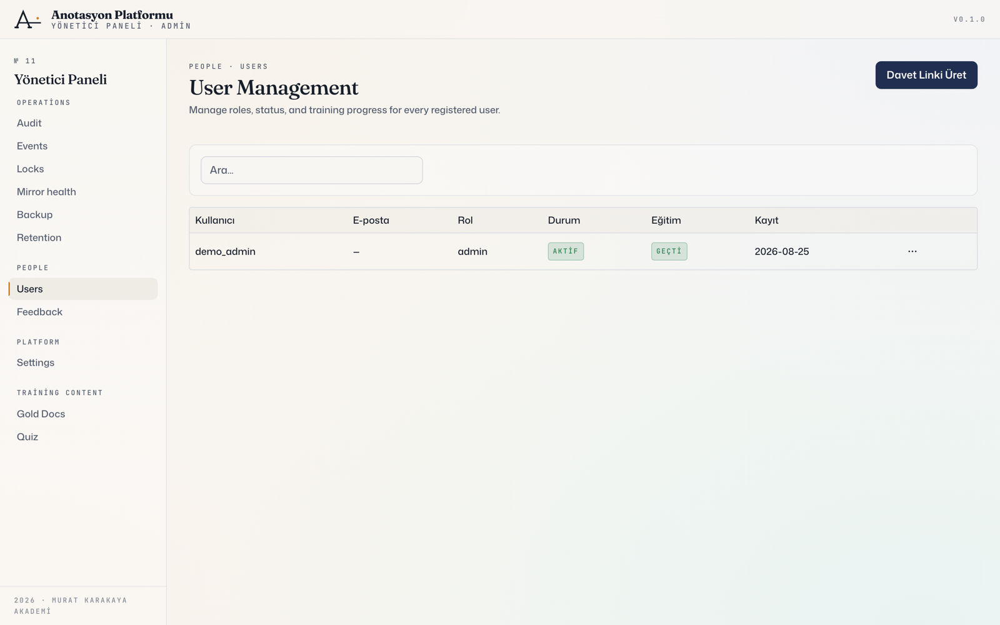

# README görselleri — onay sayfası

Bu dosya geçicidir; onaydan sonra silinecek. Amaç: README'ye koymadan önce
görselleri tek sayfada görmen.

---

## 1 · Kilit yaşam döngüsü — bildirdiğin hata

Şikâyet ettiğin çakışma buradaydı.

### Önce (mermaid) — ❌ yazılar iç içe

`heartbeat renews lease` ile `lease elapses without heartbeat` üst üste binmiş,
`swept by the locks sweeper` sol kenardan taşıyor. Tek renk, durum ayrımı yok.

### Sonra (d2) — ✅ temiz

Çakışma yok. Renk bilgi taşıyor: **yeşil** boş, **mavi** tutuluyor, **kırmızı** süresi dolmuş.

---

## 2 · Mimari — en bozuk olanı

### Önce (mermaid) — ❌ okunmuyor

Solda yarım sayfa boşluk, alt gruplar arası dört çapraz ok, okuma sırası
aşağıdan yukarı, her kutu aynı renk.

### Sonra (d2) — ✅ temiz

Soldan sağa: tarayıcı → FastAPI → SQLite → Neon. Dik açılı yönlendirme,
katman başına anlamsal renk.

> **Ödünleşme:** canlı güncelleme (SSE) oku sunucudan tarayıcıya geri döndüğü için
> döngü yaratıyor ve yerleşim motorunu okuma sırasını ters kurmaya zorluyordu.
> O oku çıkardım; SSE yolu zaten yazma-akışı sequence diyagramında adım adım var.

---

## 3 · Anotasyon durum makinesi (yeni)

`new → draft → review → verified`. Kesikli oklar geri dönüşler. Renk durumun
paylaşılırlığını kodluyor: gri yok, sarı yalnız sana ait taslak, mavi paylaşılan,
yeşil tamamlanmış.

---

## 4 · Ekran görüntüleri

İzole demo ortamı (40 gerçek özelge, ayrı port, ayrı veritabanı), Playwright ile
tarayıcıdan çekildi. **Gerçek veriye dokunulmadı.**

### Anotasyon çalışma alanı — kapak görseli önerim

Üç panel: belge listesi · özelge metni · referans kartı. Kart gerçek bir atıfla
dolu (**3065 / geçici 39**). "Kanun Adı" sözlükten otomatik geldi, alıntı belgede
birebir bulunduğu için uyarı yok, altta **"Taslak kaydedildi"** görünüyor.

### Belge akışı

Üç sekme: Yeni · Kontrol Gerekiyor · Tamamlanan.

### Yönetici paneli

Sol menü sistemin kapsamını gösteriyor: Audit, Events, Locks, Mirror health,
Backup, Retention, Users, Feedback, Settings, Gold Docs, Quiz.

---

## Önermediklerim

| Görsel | Neden |
|---|---|
| Giriş ekranı | Sade bir form, anlatacak bir şeyi yok |
| İstatistik sayfası | Demo taze olduğu için tamamen sıfır — README'de zayıf durur |

İstersen istatistikler için sahte aktivite üretip dolu halini alabilirim.

---

## Araç araştırması

| Seçenek | Karar |
|---|---|
| **d2** (ELK yerleşim motoru) | ✅ Kullanıldı — dik açılı yönlendirme + tema, mermaid'de yok |
| **mermaid** | Sequence ve ER için kalıyor; onları iyi çiziyor, GitHub'da canlı render |
| **MCP sunucuları** | ❌ Eklemedim — hepsi yereldeki CLI'ları sarmalıyor, yerleşime katkısı yok |
| **Excalidraw / draw.io** | ❌ Elle çizim, kaynaktan üretilemez |

**MCP hakkında:** bulduğum sunucular mermaid'i PNG'ye çeviriyor — bunu `mermaid-cli`
ile zaten yapıyorum. Sorun render değil *yerleşim algoritmasıydı*; onu d2 çözdü.
Kullanılmayan bir bağımlılık hakeme "gereksiz" görünür, "şık" değil.

---

## Onaylarsan

- Diyagram kaynakları `docs/diagrams/*.d2` — `docs/diagrams/build.sh` ile yeniden üretilebilir
- Çıktılar `docs/images/` — hem SVG hem PNG (GitHub SVG'de yazı tipini düşürebiliyor, README'de PNG kullanacağım)
- README güncellenir, `_review/` klasörü ve bu dosya silinir, `main`'e merge edilir
