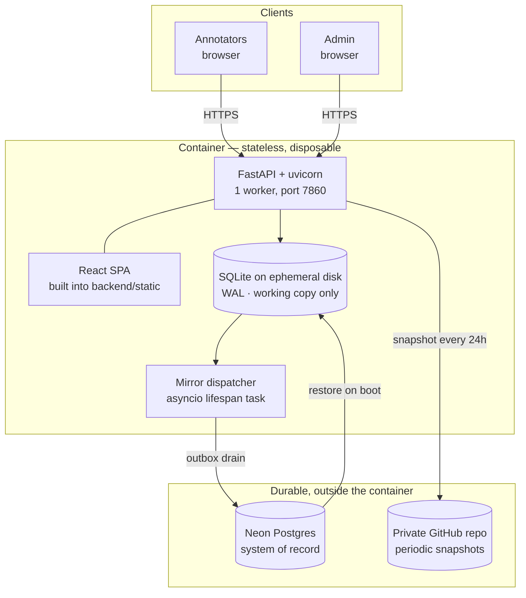
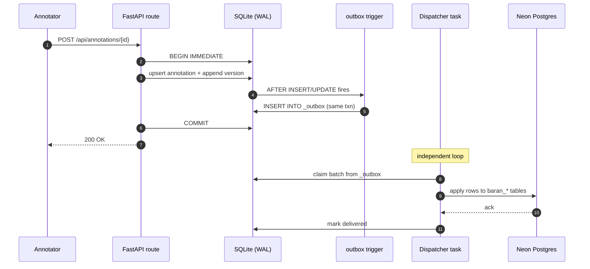
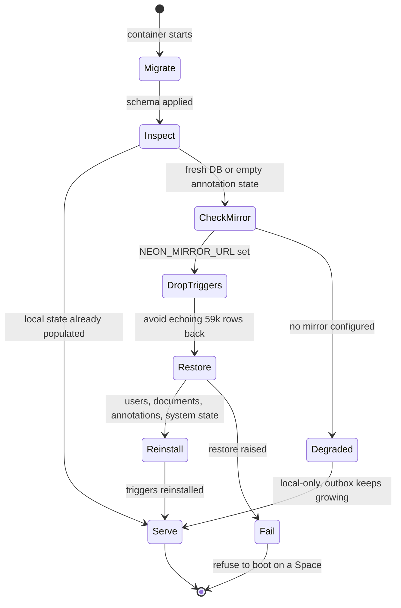
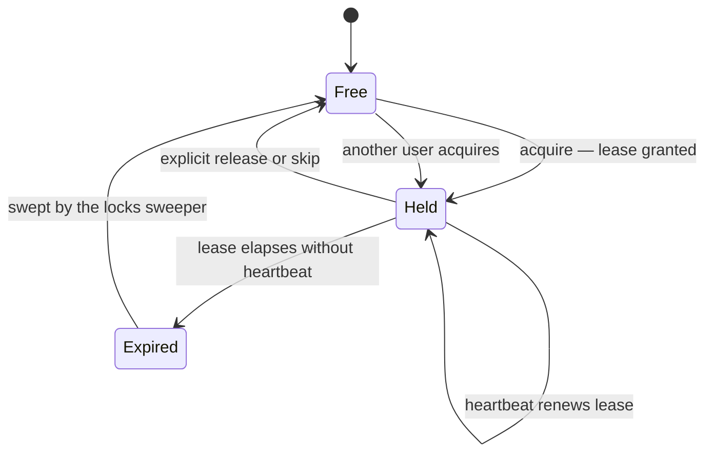
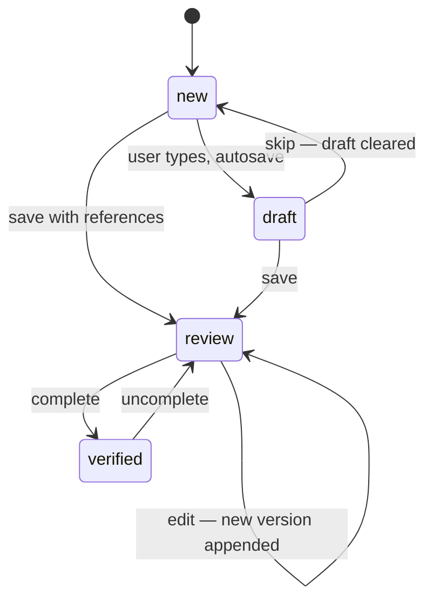
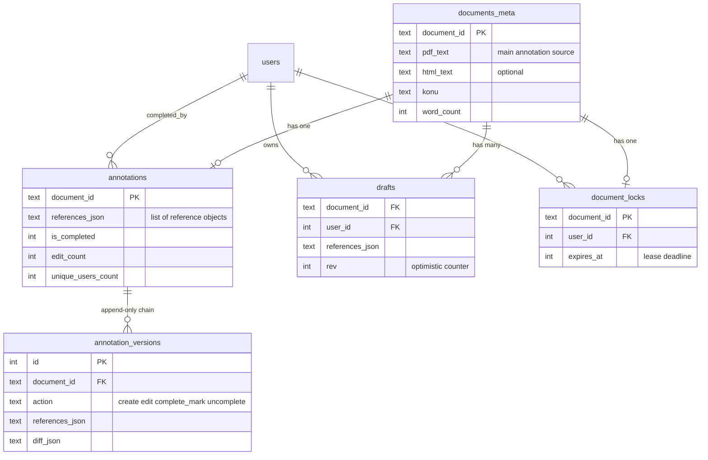
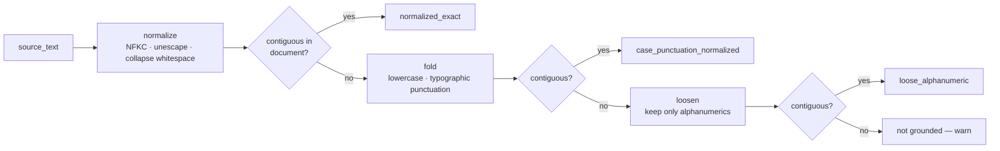
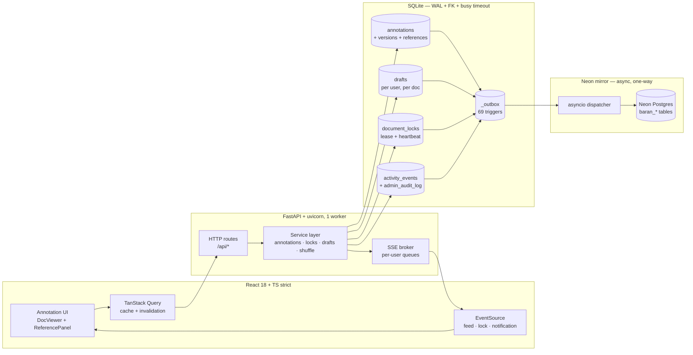

<div align="center">

# Annotation Platform

**A collaborative web app for annotating Turkish tax-authority rulings (*özelge*)
with structured legal references — built for scholarship annotators, queried by
tax practitioners.**

[](https://www.python.org/)
[](https://fastapi.tiangolo.com/)
[](https://www.sqlite.org/)
[](https://neon.tech/)
[](https://react.dev/)
[](https://www.typescriptlang.org/)
[](https://vitejs.dev/)
[](#tests)

</div>

---

## What is this?

Tax-ruling annotation is the painful inverse of legal drafting: a human reads
an opinion letter, identifies every statute / regulation / decree it relies on,
and pins each citation to a structured record (`kanun_no`, `madde`, `fıkra`,
`bent`, `source_text`). At scale — tens of thousands of rulings — this only
works as a coordinated team activity with locking, attribution, and a verifiable
change history.

This platform does that:

- **Multi-user concurrent editing** with leased document locks + lease renewal.
- **Draft autosave** at 2 s debounce so a closed tab never loses work.
- **Tab-based feed** (`Yeni` / `Devam Eden` / `Tamamlanan`) with a deterministic
  per-user daily shuffle: the same operator gets the same order all day — and a
  different one tomorrow.
- **Append-only version chain** with diff-from-previous on every save.
- **Verbatim quote grounding** — every citation must quote a span that actually
  occurs in the ruling, under a matcher shared byte-for-byte with the downstream
  quality gate.
- **Durable state on ephemeral compute** — the container can be destroyed at any
  moment without losing an annotation.
- **Gamification** (XP, streak, badges) to keep scholarship annotators motivated
  without warping incentives.
- **Admin panel** for user provisioning, training quizzes, audit log, system
  events, retention controls, and off-host backups.

### By the numbers

| | |
|---|---|
| Backend | 145 Python files · ~17.4k lines · 56 API routes |
| Frontend | 274 TS/TSX files · ~28.4k lines |
| Schema | 21 idempotent migrations · 69 outbox triggers |
| Tests | 1,340 backend · 642 frontend (112 files) · 4 e2e specs |

---

## Features at a glance

| Area | Highlights |
|------|------------|
| **Annotation** | Reference cards with `kanun_no` + `kanun_ad` validation, verbatim quote grounding, set-semantic diff |
| **Concurrency** | Leased locks with heartbeat, `BEGIN IMMEDIATE` for every writer, single-writer SQLite |
| **Drafts** | Per-user, per-doc, autosaved with debounce + AbortController + revision counter |
| **Feed** | 4-state canonical `workflow_state`, per-user mutual exclusion, deterministic daily shuffle |
| **Durability** | Trigger-driven outbox → async dispatcher → Neon Postgres; fail-closed restore on boot |
| **Training** | Mandatory quiz → 3-doc training → pass / fail gate before live annotation |
| **Auth** | Cookie session, bcrypt(rounds=12), Origin/Referer CSRF middleware in production |
| **Rate limiting** | In-memory sliding window per IP, namespaced (login / register / save) |
| **Backups** | SQLite snapshot → private GitHub repo via fine-grained PAT; sessions excluded |
| **Observability** | `activity_events`, `system_events`, `admin_audit_log`; SSE broker for live updates |

---

## System design

The deployment is deliberately split into **stateless compute** and **stateful
storage you do not own the uptime of**. The container is disposable; nothing
important lives inside it.



**The single most important property:** if the container dies, is rescheduled,
or is recreated on another host, the next boot rebuilds its entire local state
from Neon. Losing the container is a non-event.

---

## Durability model

This is the part worth reading. SQLite is used as a **local working copy**, not
as the system of record, and the two are reconciled by an outbox.

### Write path

Every mutating statement fires a trigger that enqueues a row in `_outbox`,
inside the same transaction as the write itself. The dispatcher drains that
queue asynchronously.



Because the outbox insert is part of the caller's transaction, a committed
annotation is *always* queued. There is no window where a write succeeds
locally but was never scheduled for the mirror.

### Boot path — fail closed

A fresh container starts with an empty SQLite file. Rather than serving an
empty corpus, boot restores from Neon and refuses to run if it cannot.



Two details that matter:

- **Triggers are dropped during restore.** Replaying ~59k rows through the
  outbox would enqueue them straight back to Neon — a pointless round trip that
  also masks real queue depth. They are reinstalled once the restore lands.
- **On a Space, a failed restore is fatal.** `SPACE_ID` is set by the platform;
  when it is present and the restore fails, the process raises instead of
  serving an empty corpus that would then mirror emptiness back to Neon.

### Known limits

Stated plainly, because a durability section that only lists strengths is
marketing:

| Limit | Consequence |
|---|---|
| `stop()` cancels the dispatcher without a final drain | Undelivered outbox rows in ephemeral SQLite are lost on shutdown. The window is seconds, but it is not zero. |
| Dispatcher singleton guard is a PID file | It protects against dual-boot on one host, not two hosts writing to one Neon. Never run two instances. |
| Boot restore transfers the full corpus | Cold starts are expensive. Scale-to-zero hosting is a poor fit. |

---

## Concurrency model

Single uvicorn worker, WAL-mode SQLite, and document-level leases. This removes
an entire class of distributed-systems failure the project does not need.



Layers, from coarse to fine:

1. **Document lease** — one annotator edits a document at a time. Leases are
   renewed by heartbeat and reaped by a background sweeper, so a crashed tab
   frees the document instead of parking it forever.
2. **`BEGIN IMMEDIATE`** — every writer takes the reserved lock up front, so
   two concurrent writers fail fast at BEGIN instead of deadlocking at COMMIT.
3. **Draft revision counter** — the autosave path is optimistic; a stale
   revision is rejected rather than silently overwriting newer keystrokes.
4. **Atomic complete** — save, complete, and draft-clear collapse into one
   `BEGIN IMMEDIATE`. Earlier revisions ran this as a three-call chain and had
   an intermediate-failure surface; that surface no longer exists.

---

## Annotation workflow

Every document lives in exactly one of four states **per user**, computed
server-side and returned as `FeedItem.workflow_state`.



| State | Meaning | Tab | Icon |
|-------|---------|-----|------|
| `new` | No annotation row, no non-empty caller draft | Yeni | ○ |
| `draft` | Caller has ≥1 reference in their draft, no shared annotation yet | Devam Eden | ◉ |
| `review` | Shared annotation exists, not yet completed | Devam Eden | ◌ |
| `verified` | Annotation completed (`is_completed = 1`) | Tamamlanan | ✓ |

`draft` is private to the caller; `review` and `verified` are shared. That
asymmetry is what lets several annotators queue work on the same corpus without
seeing each other's half-finished thinking.

---

## Data model

The reference is the unit of work; everything else exists to attribute it, order
it, or prove how it changed.



A reference is six fields — `kanun_no`, `kanun_ad`, `madde`, `fıkra`, `bent`,
`source_text`. The first five identify the provision; the sixth proves it.

---

## Verbatim quote grounding

Every reference must carry a `source_text` that occurs in the ruling **as one
contiguous span**. This is enforced in the annotation UI and re-checked by the
downstream quality gate, and the two implementations are kept behaviourally
identical on purpose.



Three escalating normalizations, tried in order; the weakest one that matches
wins. Anything that matches none of them is not grounded.

**Why contiguity is the whole point.** An earlier rule accepted a quote when
≥80 % of its words appeared *anywhere* in the document. That was meant as typo
tolerance, but it also accepted quotes reassembled from non-adjacent fragments —
a shared lead-in re-prefixed onto each item of a list of articles, for example.
Measured over a 1,294-document batch, 563 of 6,098 human quotes (9.2 %) were not
contiguous, and the permissive rule stayed silent for 98.4 % of them. The
annotator was told the quote was fine; the pipeline rejected it much later, with
nobody watching.

The frontend matcher (`frontend/src/lib/validateReferences.ts`) is now a port of
the Python gate, with a parity table in its test suite pinned to the reference
implementation's output. If the two ever drift, the suite fails.

---

## Architecture



Design notes and ADRs live in [`docs/superpowers/`](docs/superpowers/).

---

## Tech stack

<table>
<tr>
<td valign="top" width="50%">

### Backend
- **Runtime:** Python 3.11+, FastAPI, uvicorn (1 worker)
- **Local store:** SQLite (`journal_mode=WAL`, foreign keys, busy timeout)
- **Durable store:** Neon Postgres via trigger-driven outbox
- **Validation:** Pydantic v2 + `model_validator`
- **Auth:** Cookie session, bcrypt(rounds=12), Origin/Referer middleware
- **Rate limiting:** in-memory sliding window
- **Migrations:** idempotent files in `backend/migrations/`
- **SSE:** per-user `asyncio.Queue` broker

</td>
<td valign="top" width="50%">

### Frontend
- **Framework:** React 18 + Vite 5 + TypeScript strict
- **Routing:** React Router v6
- **Server state:** TanStack Query 5 (`useInfiniteQuery` + invalidate)
- **Client state:** Zustand
- **Forms:** react-hook-form + zod resolver
- **UI:** Tailwind CSS + shadcn/ui (Radix primitives)
- **Markdown:** react-markdown + rehype-sanitize (no `rehype-raw`)

</td>
</tr>
</table>

---

## Quick start

### Development

```bash
# 1. Backend
python3 -m venv .venv
.venv/bin/pip install -r requirements-dev.txt
.venv/bin/python -m uvicorn backend.main:app --reload

# 2. Frontend (separate shell)
cd frontend
npm install
npm run dev
```

The dev backend listens on `http://127.0.0.1:8000`, the frontend on
`http://localhost:5173`. The dev DB lives at `data/db/annotations.db`
(override via `DATA_DIR`). `ENVIRONMENT=development` keeps secret enforcement
off so the defaults work.

### Production (Docker)

```bash
cp .env.example .env.production
# edit .env.production: set ENVIRONMENT=production,
# generate a strong SESSION_SECRET (openssl rand -hex 32),
# set BOOTSTRAP_ADMIN_USERNAME + BOOTSTRAP_ADMIN_PASSWORD (>=12 chars)
docker compose --env-file .env.production up -d
```

Startup order:

1. Validate `ENVIRONMENT ∈ {development, test, production}`.
2. In production: hard-fail on unsafe secrets, invalid or non-HTTPS origins,
   and unsafe forwarded-IP trust configuration.
3. Apply pending migrations idempotently.
4. Restore from the Neon mirror when local state is empty (see
   [Durability model](#durability-model)).
5. Seed the first admin only when the users table has no active admin.

The full production runbook lives in **[docs/deployment.md](docs/deployment.md)**.

---

## Environment variables

| Var | Required | Prod-required | Notes |
|-----|----------|---------------|-------|
| `ENVIRONMENT` | no | **yes** | One of `development`, `test`, `production` |
| `SESSION_SECRET` | yes | **yes** | ≥32 chars in production; `openssl rand -hex 32` |
| `NEON_MIRROR_URL` | no | **yes on a Space** | Durable Postgres mirror; boot refuses without it when `SPACE_ID` is set |
| `ALLOWED_ORIGINS` | no | **yes** | Comma-separated origins for the CSRF middleware |
| `SESSION_COOKIE_NAME` | no | no | Defaults to `anotasyon_session` |
| `SESSION_MAX_AGE_SECONDS` | no | no | Browser and server session lifetime; default 30 days |
| `SESSION_COOKIE_SAMESITE` | no | no | Defaults to `lax`; `none` only for cross-site embedding |
| `BOOTSTRAP_ADMIN_USERNAME` | no | recommended | First-admin seed username |
| `BOOTSTRAP_ADMIN_PASSWORD` | no | recommended | First-admin password (≥12 chars in production) |
| `BACKUP_REPO_URL` | no | recommended | GitHub repo for off-host snapshots; default cadence 24 h |
| `GITHUB_PAT` | no | required if backup set | Fine-grained PAT, `contents:write` only |
| `DATA_DIR` | no | no | `/data` in the container |
| `TRUST_FORWARDED_FOR` | no | no | Enable only behind a trusted reverse proxy |
| `TRUSTED_PROXY_CIDRS` | no | with forwarded trust | Immediate trusted proxy networks only |

See [`.env.example`](.env.example) for the annotated template.

---

## Failure modes

What breaks, what the system does about it, and what an operator should do.

| Condition | Behaviour | Operator action |
|---|---|---|
| Neon unreachable at runtime | Degraded mode: writes keep committing locally, `_outbox` grows, dispatcher retries with exponential backoff | Watch queue depth; restore connectivity |
| Neon unreachable at boot **on a Space** | Process refuses to start rather than serve an empty corpus | Fix `NEON_MIRROR_URL` / network, restart |
| `NEON_MIRROR_URL` unset off-Space | Boots local-only, logs `neon_mirror_unreachable` | Fine for development; never for production |
| Container killed mid-drain | Undelivered outbox rows are lost with the ephemeral disk | Prefer always-on hosting; avoid scale-to-zero |
| Two instances against one Neon | PID guard does not span hosts; concurrent writers can interleave | Never run two; pause the old one before starting the new |
| Annotator tab crashes holding a lease | Lease expires, sweeper reclaims the document | None |
| Migration fails | Startup aborts before serving | Inspect logs; migrations are idempotent and safe to retry |

---

## Tests

Backend uses pytest with a per-test SQLite fixture; frontend uses Vitest with
MSW-mocked endpoints and Playwright for e2e smoke flows.

```bash
.venv/bin/python -m pytest tests -q                              # backend
cd frontend && npm run test:run -- --reporter=basic              # frontend unit
cd frontend && npm run e2e                                       # Playwright e2e
```

Current counts: **1,340 backend** · **642 frontend** across 112 files · **4 e2e
spec files**. Numbers drift; run the commands above for live truth.

### Healthcheck

- **Liveness:** `GET /api/health` — process up. The Docker `HEALTHCHECK` uses
  only this, so a transient SQLite lock never triggers a restart loop.
- **Readiness:** `GET /api/health/db` — migration state and table counts.

---

## Project structure

```
AnnotationPlatform/
├── backend/
│   ├── annotations/          # save / complete / draft / version chain
│   ├── locks/                # leased document locks + heartbeat
│   ├── shuffle/              # 3-tab feed + per-user daily shuffle
│   ├── documents/            # ingest + metadata + storage
│   ├── mirror/               # outbox dispatcher, Neon client, schema sync
│   ├── quality/              # DQCheck adapter + vendored core
│   ├── training/             # quiz + 3-doc training flow
│   ├── gamification/         # XP, streaks, badges
│   ├── behavioral/           # post-save detectors
│   ├── admin/                # users / audit / settings / system events
│   ├── feedback/             # user complaints + admin list
│   ├── notifications/        # in-app notification persistence
│   ├── backup/               # SQLite snapshot → GitHub
│   ├── retention/            # row-level data lifecycle
│   ├── exports/              # CSV / JSONL annotation exports
│   ├── sse/                  # per-user event broker
│   ├── shared/               # db, audit, csrf, rate_limit, validators
│   ├── migrations/           # 21 idempotent migrations + trigger generator
│   ├── users/                # auth + session deps
│   └── main.py               # app factory + lifespan
├── frontend/
│   ├── src/
│   │   ├── api/              # openapi-typescript types + queries + client
│   │   ├── components/       # annotation/ shell/ training/ admin/ ui/
│   │   ├── routes/           # AnnotateDoc / Training / Admin / Feedback
│   │   ├── hooks/            # useLock / useDraft / useReferencesState / sse
│   │   ├── stores/           # Zustand (auth, annotate, sort)
│   │   └── lib/              # validateReferences / quoteMatcher / formatters
│   └── e2e/                  # Playwright smoke + a11y
├── tests/                    # backend pytest
├── analysis/annotation_quality/   # quality + performance report scripts
├── docs/
│   ├── deployment.md         # production runbook
│   ├── annotation-quality-harness/
│   └── superpowers/          # design specs + ADRs
├── runbooks/                 # restore drill, demo protocol
├── Dockerfile                # 3-stage: SPA build → deps → slim runtime
└── docker-compose.yml
```

---

## Security notes

- **CSRF:** Origin/Referer middleware, production-only enforcement, allowlist
  via `ALLOWED_ORIGINS`.
- **Sessions:** cookie + bcrypt(rounds=12); `__Host-` prefix planned after the
  staging audit.
- **CSV exports:** leading `=` / `+` / `-` / `@` quoted to defang spreadsheet
  injection.
- **Markdown:** `rehype-sanitize` only — `rehype-raw` is forbidden (XSS bypass).
- **Backups:** `user_sessions` excluded from the dump; the backup repo is
  private and its PAT is scoped to `contents:write`.
- **Container:** multi-stage build, non-root runtime user, build toolchain never
  reaches the runtime image.
- **Deployment:** the Space receives a historyless, path-whitelisted commit —
  internal docs, research data, runbooks and tests never enter the public tree.

---

## Releases & tags

Latest tag: **`phase-6`** (2026-05-24) — *Cross-team coordination ordering*
(commits `ca4328e .. 810b8ea`).

Post-`phase-6` work on `main` includes the feedback system
(`backend/feedback/`, migration `v0016_user_feedback`, routes `/feedback` and
`/admin/feedback`) and the verbatim-grounding contract alignment — shipped but
not yet tagged. See `git tag` and `docs/superpowers/specs/`.

---

<div align="center">

Made with the help of [Claude Code](https://claude.com/claude-code).

</div>
