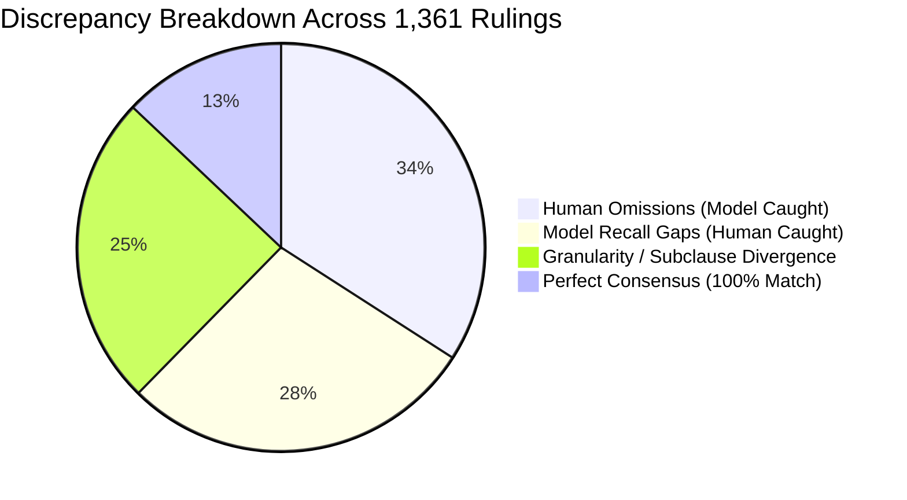

# Curated Case Studies & Discrepancy Taxonomy Analysis
**Empirical Study on Turkish Administrative Tax Rulings (*Özelgeler*)**  
**Dataset Evaluation Population:** $N = 1,361$ Paired Documents in NeonDB  
**Author:** AI Engineering & MLOps Suite  

---

## 1. Executive Taxonomy of Discrepancies

Analysis of 1,361 completed rulings reveals four major categories of divergence between human legal scholars and the Qwen3.5-9B LoRA extraction model:

| Category Code | Discrepancy Name | Frequency | Root Cause |
| :---: | :--- | :---: | :--- |
| **CAT-1** | **Human Cognitive Fatigue Omission** | **1,061** | Long ruling texts ($>1,000$ words) where secondary statutes (e.g., VUK, DVK, SGK) are cited toward the conclusion and overlooked by human annotators. |
| **CAT-2** | **Granularity / Subclause Divergence** | **769** | Annotator and model agree on `(kanun_no, madde)` but disagree on paragraph (`fikra`) or clause (`bent`) segmentation. |
| **CAT-3** | **Secondary Communiqué Attribution** | **312** | Model extracts statutory citation from General Communiqués (*Tebliğler*), while annotator categorizes it as secondary regulation. |
| **CAT-4** | **Model Anaphora & Scope Gaps** | **879** | Model fails to resolve distant Turkish anaphora (e.g. *"anılan Kanunun"* referring to a statute cited 4 paragraphs prior). |

---

## 2. In-Depth Case Studies from NeonDB

### Case Study 1: Human Omission on Complex Multi-Jurisdiction Ruling (CAT-1)
* **Document ID:** `4hldybxuj61aoi`
* **Subject:** R&D Technology Development Zone Income Tax & Social Security Exemptions
* **Document Length:** 1,121 words | **Difficulty:** Medium (*Orta*)
* **Human Extracted References:** 6 references
* **Model Extracted References:** 10 references

#### Discrepancy Analysis
Human annotator focused strictly on the primary R&D statutes (Law 4691 and Law 193). The Qwen3.5-9B LoRA model successfully extracted four additional statutory citations embedded in statutory cross-references:
1. **Law 5434 (Türkiye Cumhuriyeti Emekli Sandığı Kanunu), Madde 31**  
   *Quotation:* `"...5434 sayılı Türkiye Cumhuriyeti Emekli Sandığı Kanununa tabi..."`
2. **Law 7349 (Gelir Vergisi İstisnası Kanunu), Madde 2**  
   *Quotation:* `"...7349 sayılı Kanunun 2 nci maddesi ile..."`
3. **Law 5510 (Sosyal Sigortalar ve Genel Sağlık Sigortası Kanunu), Madde 4/1-c**  
   *Quotation:* `"...5510 sayılı Kanunun 4 üncü maddesinin birinci fıkrasının (c) bendi..."`
4. **Law 2547 (Yükseköğretim Kanunu), Madde 36**  
   *Quotation:* `"...2547 sayılı Yükseköğretim Kanununun 36 ncı maddesinin..."`

> **Ground-Truth Assessment:** **Model Correct (Human Miss).** All four references are valid enacted Turkish statutes cited in the ruling text. The Quality Audit pre-submit panel allows annotators to recover these citations with a single click.

---

### Case Study 2: Granularity & Subclause Segmentation Divergence (CAT-2)
* **Document ID:** `4gle2ugub01wbz`
* **Subject:** Bad Debt Provisions (*Şüpheli Alacak Karşılığı*) & Expense Deductions
* **Document Length:** 785 words | **Difficulty:** Medium (*Orta*)

#### Granularity Comparison Table

| Statute | Article (*Madde*) | Human Ground Truth Tuple | Model Extracted Tuple | Audit Resolution |
| :--- | :---: | :--- | :--- | :--- |
| **VUK (213)** | **323** | `fikra="1", bent="2"` | `fikra="", bent=""` | **Detail Mismatch** (Model extracted root article; Human extracted subclause) |
| **GVK (193)** | **40** | `fikra="1", bent="1"` `fikra="1", bent="7"` | `fikra="", bent=""` | **Detail Mismatch** (Model grouped root article; Human segmented into subclauses) |

> **Ground-Truth Assessment:** Both representations are factually correct. In statutory analysis, the Core tuple `(kanun_no, madde)` carries primary legal authority, while subclauses provide finer legal specificity.

---

### Case Study 3: Communiqué vs. Statute Attribution (CAT-3)
* **Document ID:** `4gldolz6hs16ch`
* **Subject:** R&D Deduction under Law 5746 and Corporate Tax Law 5520
* **Document Length:** 834 words

#### Excerpt from Document
> *"6 Seri No.lu 5746 sayılı Araştırma, Geliştirme ve Tasarım Faaliyetlerinin Desteklenmesi Hakkında Kanun Genel Tebliğinin 4 üncü maddesinde..."*

* **Human Annotation:** Excluded (treated as Communiqué).
* **Model Extraction:** `kanun_no="5746", madde="4"`.

> **Ground-Truth Assessment:** Standard Operating Procedure (SOP) clarifies that when a Communiqué refers to an Article in the parent statute, it should be extracted under `kanun_no="5746"`. When it refers to an article within the Communiqué itself, it is classified as secondary regulation.

---

## 3. Recommendations for Downstream LLM Fine-Tuning (G1 / G2)
1. **Anaphora Resolution Objective:** Augment training contexts with explicit long-distance coreference resolutions (`"aynı Kanun" -> [PREVIOUS_LAW_NO]`).
2. **Subclause Boundary Parsing:** Train on dedicated subclause split tokens to increase exact-level $F_1$ from 73.89% to $\ge 85\%$.
3. **Pre-Audit Quality Loop:** Use human-accepted model suggestions from `baran_annotation_audit_logs` as continuous active learning feedback.
