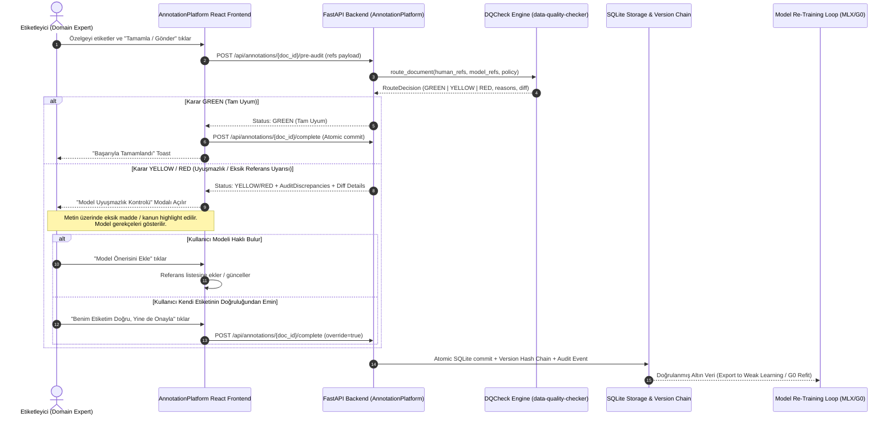

# Entegrasyon Mimarisi & Uygulama Planı: `data-quality-checker` x `AnnotationPlatform`

## 🎯 Proje Vizyonu & Temel Prensip

Bu entegrasyonun amacı; etiketleyiciler **AnnotationPlatform** üzerinde bir Türk vergi hukuku / özelge metnini etiketleyip "Kaydet / Tamamla" (Submit) butonuna bastıklarında, arka planda **data-quality-checker (dqcheck)** motorunun çalıştırılarak insan etiketleri ile model tahminlerinin (G0 / Qwen3.5-9B / Q36) anlık karşılaştırılmasıdır.

> [!IMPORTANT]
> **Altın Kural: "Model de Yanlış Olabilir!" (Cognitive Safeguard)**
> Model bir referans kaçırmış veya halüsinasyon görmüş olabilir. Kullanıcı hiçbir zaman modelin çıktısını kabul etmeye zorlanmamalı; sistem uyuşmazlıkları ve eksiklikleri bilgilendirici ve eğitici bir "Gözden Geçirme / Doğrulama Uyarısı" (Pre-Submit Audit) olarak sunmalıdır. Kullanıcı her zaman *"Benim Etiketim Doğru, Yine de Kaydet"* seçeneğiyle kendi kararını onaylayabilmelidir.

---

## 🏛️ Entegrasyon Mimarisi ve Veri Akışı

---

## 🧩 Modüler Bileşenler ve Görev Dağılımı

### 1. Model Tahmin Stratejisi (Prediction Backend)
- **Mod A (Önceden Üretilmiş - Batch Ingest / Önerilen)**:
  - Dokümanlar platforma yüklenirken veya arka plan kuyruğunda `data_quality_checker.g0` ile taranarak her dokümanın model referansları `model_predictions` tablosunda saklanır (sıfır gecikme).
- **Mod B (Canlı / On-Demand MLX Inference)**:
  - Apple Silicon üzerinde çalışan yerel MLX Worker servisi aracılığıyla anlık tahmin üretilir.

### 2. FastAPI Backend Entegrasyonu (`AnnotationPlatform/backend`)
- **Yeni Endpoint**: `POST /api/annotations/{doc_id}/pre-audit`
  - Girdi: Etiketleyicinin mevcut referans listesi (`[{kanun_no, kanun_ad, madde, fikra, bent, source_text}]`).
  - İşlem:
    - Dokümanın model tahminini çeker.
    - `data_quality_checker.router.route_document` ve `normalization` fonksiyonlarını çağırır.
    - `reference_policy` (örn. `ignore_vuk_213_article_413_v1`) filtrelerini uygular.
  - Çıktı: `AuditResult`
    - `bucket`: `GREEN` | `YELLOW` | `RED` | `QUARANTINE`
    - `reasons`: `missing_core_reference`, `extra_or_different_core_reference`, `extension_mismatch`, `evidence_mismatch` vb.
    - `discrepancies`: Modelin bulup kullanıcının kaçırmış olabileceği veya kullanıcının ekleyip modelin görmediği referansların detaylı listesi.

### 3. Frontend UI/UX Etkileşimi (`AnnotationPlatform/frontend`)
- **Denetim Modalı (`QualityAuditModal.tsx`)**:
  - Yeşil (`GREEN`): Doğrudan tamamlanır, modal açılmaz.
  - Sarı / Kırmızı (`YELLOW` / `RED`):
    - Başlık: *"Model ile Etiketiniz Arasında Farklılık Tespit Edildi"*
    - Alt Metin: *"⚠️ Unutmayınız: Model yanılıyor olabilir. Lütfen aşağıdaki farklılıkları hukuki metne göre teyit ediniz."*
    - **Karşılaştırma Kartları**:
      - 📌 *Modelin Tespit Ettiği Referans*: (Örn: VUK Madde 114 - Zamanaşımı) + Kaynak Metin Alıntısı.
      - 📌 *Sizin Etiketleriniz*.
    - **Aksiyon Butonları**:
      1. `[+] Model Önerisini Ekle ve Tamamla`
      2. `[✓] Benim Etiketim Doğru, Yine de Kaydet` (Override)
      3. `[✎] Düzenlemeye Geri Dön`
- **Metin Üzerinde Highlight**: Modelin iddia ettiği referansın kaynak metin parçasını doküman okuyucuda sarı/kehribar vurguyla gösterme.

### 4. Geri Besleme Döngüsü (Continuous Weak Learning & Model Refit)
- Kullanıcının `override` ettiği durumlar ile `accept` ettiği durumlar `annotation_audit_logs` tablosuna işlenir.
- Bu veriler doğrudan `data-quality-checker`'ın `release` ve `train-g0` aşamalarına aktarılarak modelin zayıf olduğu noktalar üzerinde yeniden eğitilmesi (active learning loop) sağlanır.
