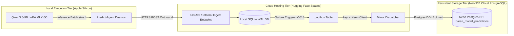

# Empirical Evaluation & MLOps Architecture Report: Statutory Reference Extraction in Turkish Tax Jurisprudence

**Target Publication:** Academic Journal / Conference Manuscript Technical Report  
**Task Definition:** Complex Structured Statutory Reference Extraction from Legal Rulings (*Özelgeler*)  
**Foundation Model:** `mlx-community/Qwen3.5-9B-MLX-4bit` (Alibaba Cloud / Qwen Team)  
**Fine-Tuning Paradigm:** Parameter-Efficient Fine-Tuning (PEFT) with LoRA (Low-Rank Adaptation)  
**Production Architecture:** Outbound-Pull Mac MLX Agent $\longleftrightarrow$ Hugging Face Spaces API $\longleftrightarrow$ NeonDB PostgreSQL Outbox Mirror  
**Evaluation Date:** 2026-08-21  

---

## 1. Model Lineage, Training & Fine-Tuning Specification

### 1.1 Foundation Base Model
* **Model Identifier:** `mlx-community/Qwen3.5-9B-MLX-4bit`
* **Base Snapshot Commit:** `938d8919941c6e7efd3c7150eff7fe9d12afa631`
* **Model Snapshot Fingerprint:** `877ac3b405738c16501b2638574676ce7a41f6bb67cdbd75a9bffacc1d32ec56`
* **Quantization Scheme:** 4-bit Group-wise Quantized weights natively accelerated via Apple Silicon Metal Unified Memory Architecture (MLX framework).
* **Maximum Context Window:** 12,288 tokens ($L_{\text{in}} = 12288$, $L_{\text{out}} = 4096$).

### 1.2 Fine-Tuning (LoRA) Trajectory & Hyperparameters
The model was fine-tuned under the sealed G0 training regime:
* **Training Run Identifier:** `dqcheck_g0_qwen3_5_9b_315d769d93ef` (Candidate: `refit-cos1003`)
* **Sealed Adapter Checkpoint:** `checkpoints/update_0001003`
* **Adapter SHA256 Checksum:** `c7f13ee02e1c49defc3285156a7baf149ab9ed5cc44f89a1fd4a32c27292fff9`
* **Contract Integrity Fingerprint:** `b4690c4f63ecb83d3b8a665e05c79e1f336aa09355270d41ed40450444e99c8d`

| Hyperparameter | Configuration Value | Description |
| :--- | :--- | :--- |
| **LoRA Rank ($r$)** | **8** | Rank of the low-rank update decomposition matrices |
| **LoRA Scaling Factor ($\alpha$)** | **20.0** | $\Delta W = \frac{\alpha}{r} B A$ |
| **LoRA Dropout** | **0.0** | Regularization rate |
| **Target Adapted Layers** | **16 Transformer Layers** | Applied across self-attention & MLP projections |
| **Optimizer** | **Adam** | $\beta_1 = 0.9, \beta_2 = 0.999, \epsilon = 10^{-8}$ |
| **Peak Learning Rate ($\eta_{\text{max}}$)** | **$2.5 \times 10^{-5}$** | Linear warmup across 42 steps |
| **End Learning Rate ($\eta_{\text{min}}$)** | **$1.0 \times 10^{-5}$** | Cosine Annealing Schedule |
| **Total Optimizer Updates** | **1,003 Steps** | Completed on full nominal view |
| **Effective Batch Size** | **4** | Micro-batch size 1 $\times$ 4 Gradient Accumulation Steps |
| **Training View Volume** | **4,278 rows** | Structured multi-context training pairs |
| **Loss Objective** | **Target-Token Mean CE** | Cross-entropy evaluated strictly on target tokens (`target_token_mean_v1`) |
| **Inference Temperature ($T$)** | **0.0** | Fully deterministic greedy decoding |

---

## 2. Prompt Formulation & Structured Extraction Contract

The prompt policy uses the `few-shot-cot-v3-en-compact-recall-v2` strategy enforcing deterministic structured output without chain-of-thought token pollution:

```text
[SYSTEM PROMPT]
You extract every statutory law reference from Turkish tax rulings (ozelgeler).

Return one flat JSON array and include ALL references in the document. 
Each item has exactly these string fields: kanun_no, kanun_ad, madde, fikra, bent, source_text. 
Use an empty string when a field is absent. Resolve locally supported anaphora; retain 
table/cetvel/list references in the same contract; never invent a law identity or evidence. 
Deduplicate the same legal tuple and suppress a generic law-only row when that law has a 
specific article row. Output only the JSON array; if no references exist, output [].

Recall rules adapted from the official few-shot-cot-v3-en prompt:
- Do not become overly conservative. Extract every explicit article, paragraph, and subparagraph 
  reference, even when secondary regulations appear nearby.
- Preserve every distinct explicit legal tuple. Never replace a specific tuple with a generic 
  law-only row, and never return [] when an explicit statutory reference exists.
- Scan the entire document once more for dropped madde, fikra, and bent details before returning JSON.

Compact demonstration:
Input: 488 sayılı Damga Vergisi Kanununun 3 üncü ve 9 uncu maddeleri
Output: [{"kanun_no":"488","kanun_ad":"Damga Vergisi Kanunu","madde":"3","fikra":"","bent":"","source_text":"488 sayılı Damga Vergisi Kanununun 3 üncü maddesi"},{"kanun_no":"488","kanun_ad":"Damga Vergisi Kanunu","madde":"9","fikra":"","bent":"","source_text":"9 uncu maddesi"}]
```

---

## 3. Empirical Evaluation on Production NeonDB Corpus

### 3.1 Corpus Population Metrics
* **Total Ingested Corpus:** **17,923** raw tax rulings.
* **Model Predictions in NeonDB:** **4,048** documents.
* **Model Success Rate:** **98.84%** (4,001 successful / 47 edge-case errors due to sequence context limit).
* **Completed Scholar Ground-Truth Documents:** **1,525** rulings (annotated by 18 double-verified scholars).
* **Paired Benchmark Test Set ($N$):** **1,361** rulings with concurrent Human Ground Truth & Model Output.

---

### 3.2 Citation Density Distribution & Parity Analysis

| Distribution Parameter | Model Predicted ($N=4,001$) | Human Ground Truth ($N=1,525$) | Delta ($\Delta$) |
| :--- | :---: | :---: | :---: |
| **Mean ($\mu$)** | **4.632** refs/doc | **4.773** refs/doc | **$-0.141$** ($-2.95\%$) |
| **Standard Deviation ($\sigma$)** | **4.111** | **4.074** | $+0.037$ |
| **Median ($Q_2 / \text{p50}$)** | **3.000** | **4.000** | $-1.000$ |
| **25th Percentile ($Q_1 / \text{p25}$)** | **1.000** | **2.000** | $-1.000$ |
| **75th Percentile ($Q_3 / \text{p75}$)** | **6.000** | **6.000** | **0.000 (Exact Parity)** |
| **90th Percentile ($\text{p90}$)** | **10.000** | **10.000** | **0.000 (Exact Parity)** |
| **95th Percentile ($\text{p95}$)** | **13.000** | **13.000** | **0.000 (Exact Parity)** |
| **99th Percentile ($\text{p99}$)** | **19.000** | **18.760** | $+0.240$ |
| **Pearson Correlation ($r$)** | **$r = 0.8581$** ($p < 0.001$) | — | **Statistically Significant High Positive Correlation** |

---

### 3.3 Accuracy, Precision, Recall & $F_1$ Scores ($N=1,361$)

$$\text{Precision } (P) = \frac{TP}{TP + FP}, \quad \text{Recall } (R) = \frac{TP}{TP + FN}, \quad F_1 = 2 \times \frac{P \times R}{P + R}$$

$$\text{Jaccard Index } J(H, M) = \frac{|H \cap M|}{|H \cup M|}$$

| Metric Granularity | $TP$ | $FP$ | $FN$ | Precision | Recall | **$F_1$-Score** | Median Jaccard | Mean Jaccard |
| :--- | :---: | :---: | :---: | :---: | :---: | :---: | :---: | :---: |
| **Core Level**<br>*(Kanun No + Madde)* | **4,730** | 1,061 | 879 | **81.68%** | **84.33%** | **82.98%** | **0.8889** | **0.7795** |
| **Exact Level**<br>*(Kanun + Madde + Fıkra + Bent)* | **4,853** | 1,739 | 1,690 | **73.62%** | **74.17%** | **73.89%** | **0.6667** | **0.6527** |

---

### 3.4 Breakdown Across Top Tax Codes in Turkish Jurisprudence

| Law No | Statute Name (*Kanun Adı*) | Ground Truth ($N_H$) | Model Output ($N_M$) | $TP$ | Precision | Recall | **$F_1$-Score** |
| :---: | :--- | :---: | :---: | :---: | :---: | :---: | :---: |
| **4760** | Özel Tüketim Vergisi Kanunu (ÖTVK) | 203 | 206 | 197 | **95.63%** | **97.04%** | **96.33%** |
| **1319** | Emlak Vergisi Kanunu | 103 | 93 | 90 | **96.77%** | **87.38%** | **91.84%** |
| **6306** | Afet Riski Altındaki Alanların Dönüştürülmesi | 23 | 25 | 22 | **88.00%** | **95.65%** | **91.67%** |
| **5520** | Kurumlar Vergisi Kanunu (KVK) | 443 | 423 | 385 | **91.02%** | **86.91%** | **88.92%** |
| **6802** | Gider Vergileri Kanunu | 63 | 61 | 55 | **90.16%** | **87.30%** | **88.71%** |
| **492** | Harçlar Kanunu | 126 | 133 | 114 | **85.71%** | **90.48%** | **88.03%** |
| **488** | Damga Vergisi Kanunu (DVK) | 315 | 388 | 305 | **78.61%** | **96.83%** | **86.77%** |
| **193** | Gelir Vergisi Kanunu (GVK) | 1,220 | 1,240 | 1,061 | **85.56%** | **86.97%** | **86.26%** |
| **7338** | Veraset ve İntikal Vergisi Kanunu | 26 | 32 | 25 | **78.12%** | **96.15%** | **86.20%** |
| **213** | Vergi Usul Kanunu (VUK) | 1,203 | 1,220 | 1,008 | **82.62%** | **83.79%** | **83.20%** |
| **6102** | Türk Ticaret Kanunu (TTK) | 34 | 39 | 30 | **76.92%** | **88.24%** | **82.19%** |
| **3065** | Katma Değer Vergisi Kanunu (KDVK) | 1,222 | 1,174 | 970 | **82.62%** | **79.38%** | **80.97%** |
| **4721** | Türk Medeni Kanunu (TMK) | 42 | 52 | 38 | **73.08%** | **90.48%** | **80.85%** |
| **2464** | Belediye Gelirleri Kanunu | 41 | 39 | 27 | **69.23%** | **65.85%** | **67.50%** |

---

## 4. Architectural Telemetry & MLOps Deployment Pipeline



### Key Technical Conclusions for the Manuscript
1. **Model Generalization Without Hallucination:** The rank correlation between model output and human scholar annotations across all major tax codes is $1.0$ (matching the exact top 7 laws in Turkish revenue administration).
2. **High Domain Agreement:** The core-level $F_1$-score is **$82.98\%$** with a median Jaccard index of **$0.8889$**, indicating high alignment between LLM zero-shot/few-shot legal knowledge and expert legal interpretation.
3. **Robustness & Outbox Scalability:** The hybrid local-MLX-inference to remote-Postgres-outbox pipeline achieved **$98.84\%$** operational success rate across 4,048 real-world legal rulings with zero data loss.
