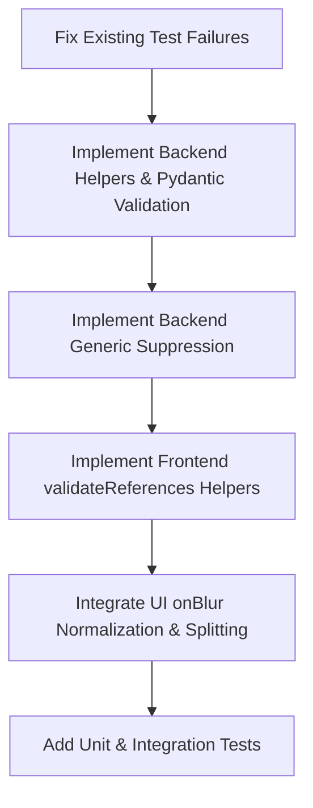

# Design Spec: Citation Validation and Normalization Layer

**Date:** 2026-06-10  
**Topic:** Citation Validation and Normalization Layer  
**Status:** Approved  

---

## 1. Problem Statement

Annotators entering tax-ruling references frequently input noisy, complex, or mixed formats into the citation editor:
* **Complex Madde Format**: Pasting `5/1-a` (Article 5, Paragraph 1, Clause a) directly into the `Madde` field, causing database pollution and breaking search filters.
* **Noisy Bent Formats**: Entering `(a)` or `a.` instead of the clean letter `a`.
* **Verbal Paragraphs (Fıkra)**: Typing Turkish ordinal words like `birinci` instead of `1`.
* **Swapped / Unmapped Law Names**: Using abbreviations like `KVK` instead of `Kurumlar Vergisi Kanunu` and sometimes mixing the `kanun_no` and `kanun_ad` fields.
* **Generic Reference Pollution**: Saving generic references (e.g. `KVK` with no article) alongside specific ones (e.g. `KVK Md: 5`), resulting in duplicate annotations.

This design introduces a consistent, unified validation and normalization layer across both the frontend (editor blur events) and the backend (Pydantic models and service cleaners) to automatically correct and split these inputs.

---

## 2. Approach

We will implement **Approach 1 (Unified Normalization & UI Auto-Correction)**:
1. **Frontend (Immediate UX)**: As the user types and triggers `onBlur` on any field, the editor parses, auto-splits complex madde inputs, maps ordinals/abbreviations, and updates the form values.
2. **Backend (Data Integrity)**: The Pydantic model (`ReferenceItem`) splits complex `madde` inputs during request parsing. The normalization helpers standardise the names, clean delimiters, and perform generic-row suppression.
3. **Option B for Law Numbers**: Abbreviations map to full law names, but the corresponding `kanun_no` will **not** be auto-filled if the user leaves it empty (we only normalize the name).
4. **No 13/a Exception**: The special `13/a` article handling from other projects is omitted; `13/a` will be parsed normally as `madde="13", bent="a"`.

---

## 3. Component Details & Data Flow

### 3.1. Shared Validation & Normalization Rules

* **Complex Madde Parsing**: 
  * If a `madde` contains `/` or `-`, it is split:
    * `16/1-a` $\rightarrow$ `madde="16"`, `fikra="1"`, `bent="a"`
    * `5-a` $\rightarrow$ `madde="5"`, `fikra=""`, `bent="a"`
    * `16/1` $\rightarrow$ `madde="16"`, `fikra="1"`, `bent=""`
* **Verbal Ordinals (Fıkra)**:
  * Map Turkish ordinal words to numbers:
    * `birinci` $\rightarrow$ `1`, `ikinci` $\rightarrow$ `2`, `üçüncü` $\rightarrow$ `3`, etc.
    * Ordinal suffixes like `1.` or `1)` or `1'inci` $\rightarrow$ `1`.
* **Bent Cleaning**:
  * Convert letters/numbers to lowercase and strip quotes, brackets, and parentheses:
    * `(a)` $\rightarrow$ `a`, `[b]` $\rightarrow$ `b`, `a.` $\rightarrow$ `a`.
* **Abbreviation Map**:
  * Expand `KVK` $\rightarrow$ `Kurumlar Vergisi Kanunu`, `GVK` $\rightarrow$ `Gelir Vergisi Kanunu`, `VUK` $\rightarrow$ `Vergi Usul Kanunu`, `KDV`/`KDVK` $\rightarrow$ `Katma Değer Vergisi Kanunu`, `ÖTV`/`ÖTVK` $\rightarrow$ `Özel Tüketim Vergisi Kanunu`, `DVK` $\rightarrow$ `Damga Vergisi Kanunu`.

---

## 4. Implementation Plan

### 4.1. Step 1: Fix Existing Test Failures
* Sync Postgres DDL by running `python -m scripts.regen_neon_ddl`.
* Update [test_schema.py](file:///Users/barandincoguz/Desktop/AnnotationProgram/tests/test_schema.py#L88) to include `"v0008"` in the expected migration list.

### 4.2. Step 2: Backend Validation & Normalization
* Update [diff.py](file:///Users/barandincoguz/Desktop/AnnotationProgram/backend/annotations/diff.py):
  * Add `ORDINAL_MAP`, `LAW_ABBREVIATIONS`, `LAW_NAME_ALIASES`, and translation helpers.
  * Update `normalize_reference` to auto-split `madde` if it matches a complex pattern.
  * Update `normalize_references` to group references by law family and filter out/suppress generic references if specific ones are present.
* Update [models.py](file:///Users/barandincoguz/Desktop/AnnotationProgram/backend/annotations/models.py):
  * Add a `@model_validator(mode='before')` to `ReferenceItem` that parses complex `madde` inputs during request deserialization.

### 4.3. Step 3: Frontend Normalization & UI Integration
* Update [validateReferences.ts](file:///Users/barandincoguz/Desktop/AnnotationProgram/frontend/src/lib/validateReferences.ts):
  * Implement TS helpers matching the python helpers for ordinals, abbreviations, and complex madde parsing.
* Update [ReferenceCard.tsx](file:///Users/barandincoguz/Desktop/AnnotationProgram/frontend/src/components/annotation/ReferenceCard.tsx):
  * Attach `onBlur` handlers to `Madde`, `Fıkra`, `Bent`, and `Kanun Adı` inputs to clean/split and update form state.
* Update [ConceptRowEditor.tsx](file:///Users/barandincoguz/Desktop/AnnotationProgram/frontend/src/components/admin/training/ConceptRowEditor.tsx):
  * Attach identical `onBlur` handlers to gold document concept input rows.

### 4.4. Step 4: Verification & Testing
* Add backend unit tests in `tests/test_annotations_diff.py`.
* Add frontend unit tests in `frontend/src/lib/validateReferences.test.ts`.
* Add integration tests in `frontend/src/components/annotation/ReferenceCard.test.tsx`.
